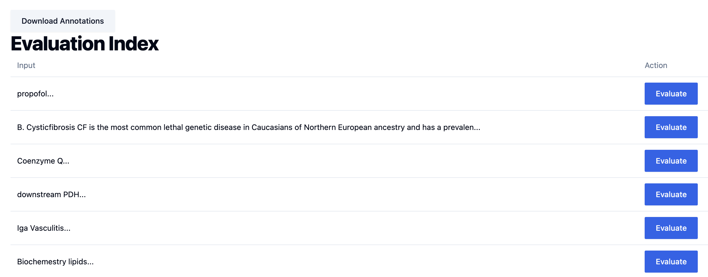
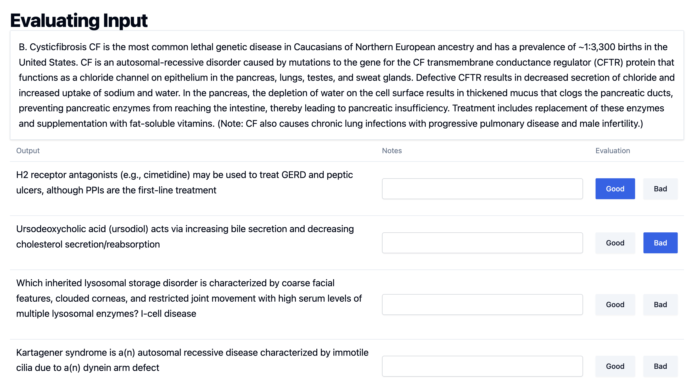

# ai-evals-workshop-materials

This is the companion repo that has shareable information used in Isaac Flath's annotation app in fasthtml workshop.

## Why FastHTML?

I like it because it feels like the most python native web development framework with the least boilerplate.

But if you're happy with fastapi, flask, django, nextjs, etc. those are fine to use too!  

This talk shows a tool, but the tool you choose isn't actually the important thing.  But you've got to choose one, and this is the one I find makes me most productive in this use-case.

## Agenda:

1. ~ 15 min: Show a real annotation app actively being used for developing a commercial product (AnkiHub)
    + Talk about use case (Retrievel in medical domain)
    + Dataset Challenges
    + Show the actual eval app and how it's used
1. ~ 5 min: Very briefly introduce fasthtml/web apps in general
1. ~ 30 min: Walk through the `main_sqlite` application code in the `app` directory
1. ~ 5 min: Deployment

## Application

There are 2 application in this repository showing introductory simple annotation apps.

- `app/main_in_memory.py`: Best place to start to understand how things work in a simple example.  Supports only good/bad rating, stores ratings in a python dict, uses a csv file for the dataset, and lets you download the ratings in a json.  This is intended to be a way to learn incrementally, not be the ideal app.
- `app/main_sqlite.py`:  This is a full annotation app that uses a sqlite database.  While minimal it has the core features you need to get started and is an example of a great starting point for this use-case.  This includes both rating and annotating the results.

## Resources to Learn FastHTML

I can't teach you everything you need to know in an hour.  Here's some resources to help dive in more:

- [Introduction of fasthtml interactivity from the HTMX perspective](https://isaacflath.com/blog/blog_post?fpath=posts%2F2025-04-22-HTMXFoundationsForFasthtml.qmd)
- [A walkthrough of a couple simple fasthtml apps](https://isaacflath.com/blog/blog_post?fpath=posts%2F2025-03-27-FastHTML-Lesson1.ipynb)
- [FastHTML Docs](doc.fastht.ml)
- [FastHTML Gallery](https://gallery.fastht.ml/)
- [MonsterUI Docs](https://monsterui.answer.ai/)

## Deployment

FastHTML apps are starlette apps (same foundation as FastAPI).  They can be deployed anywhere any regular web app can be deployed, because they are a regular web app.

The easiest places to deploy are:

- Railway: Easy to deploy - you can also do a 1 click postgres DB that your app can use instead of sqlite if you want to query your db remotely with datagrip or sqlalchemy or whatever.  If you don't know what to use, use this.
- Plash: Answer AI's hosting service (currently in beta).  Designed to be the simplest and best way to deploy a fasthtml app/
